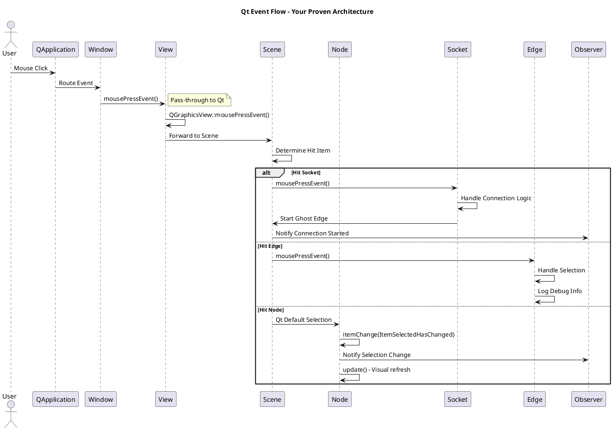
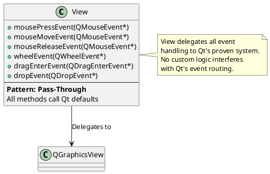
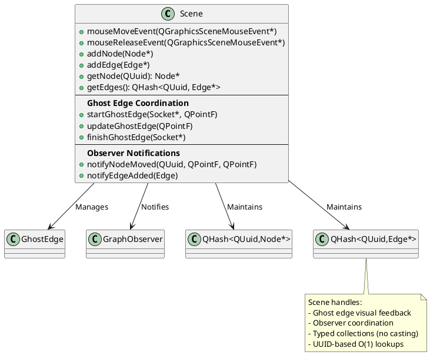
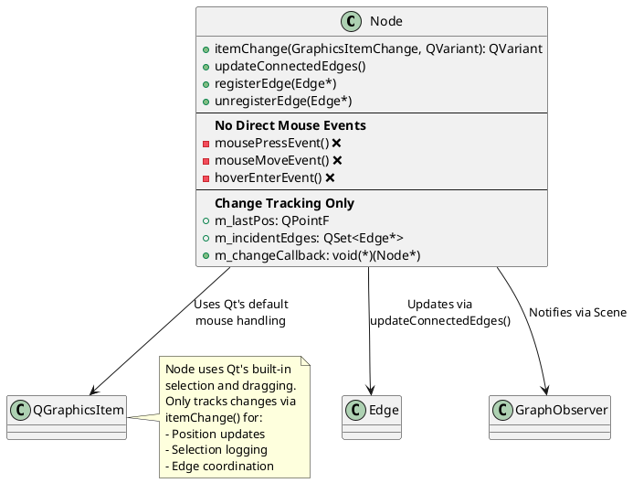
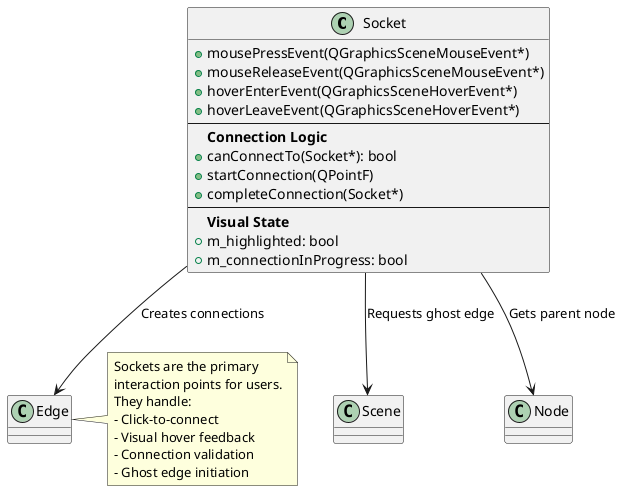
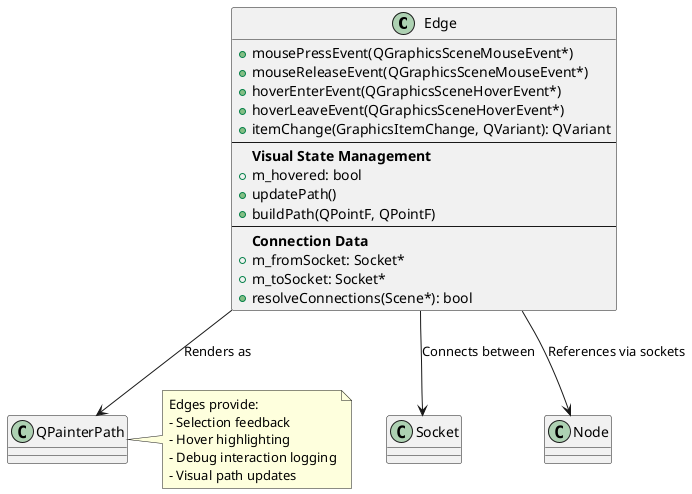
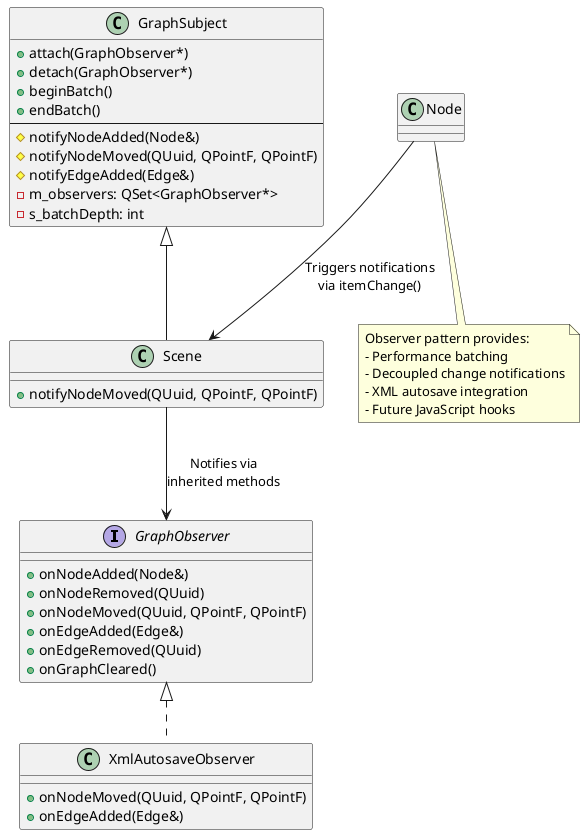
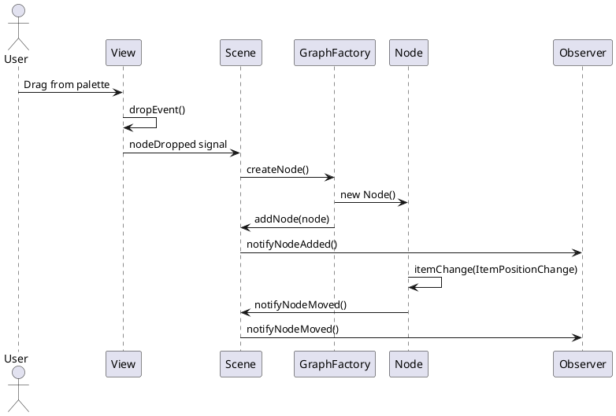
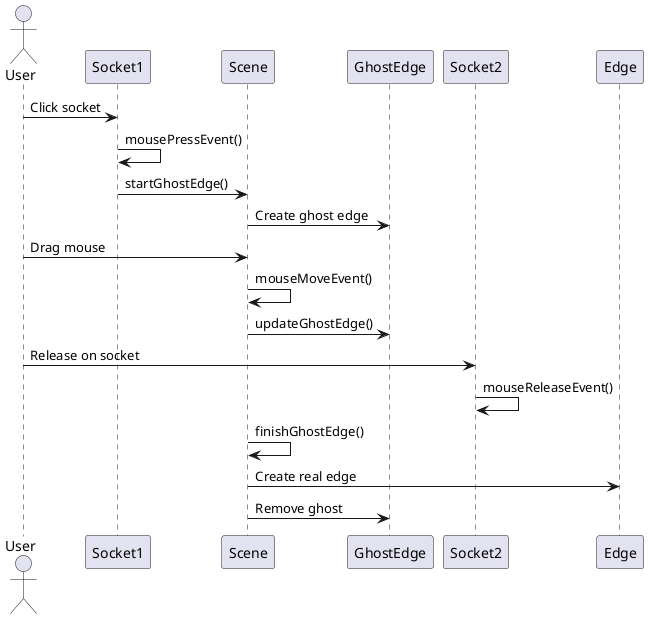

# Current Event Handling Architecture
*Comprehensive UML Documentation of Proven Foundation*

## Overview

This document maps the **actual implemented event handling system** as of August 2025, based on months of proven development. This is the foundation that JavaScript integration should respect as a **client**, not replace.

## Event Flow Architecture



## Component Event Responsibilities

### **1. View (Pass-Through Layer)**


**Implementation Pattern:**
```cpp
void View::mousePressEvent(QMouseEvent* event) {
    QGraphicsView::mousePressEvent(event);  // Pure delegation
}
```

**Why Pass-Through Works:**
- Qt's event system handles view-to-scene forwarding
- Scene determines which item was clicked
- Items handle their own specific interactions
- No interference with proven Qt patterns

### **2. Scene (Coordination Layer)**


**Scene Event Responsibilities:**
- **Ghost Edge Management:** Visual connection feedback
- **Observer Coordination:** Notify registered observers
- **Collection Management:** Maintain typed Node/Edge collections
- **NOT Item-Level Events:** Those handled by items themselves

### **3. Node (Position + Selection Tracking)**


**Node itemChange() Logic:**
```cpp
if (change == ItemSelectedHasChanged) {
    // Log selection, trigger visual update
    update();
} else if (change == ItemPositionHasChanged) {
    // Update connected edges, notify observers
    updateConnectedEdges();
    scene->notifyNodeMoved(m_id, oldPos, newPos);
}
```

**Why No Direct Mouse Events:**
- Qt handles node selection automatically
- Qt handles node dragging automatically  
- Node only needs to react to **completed changes**
- Simpler, more reliable than custom mouse handling

### **4. Socket (Connection Interface)**


**Socket Event Responsibilities:**
- **Primary User Interface:** Sockets are where users interact to create connections
- **Connection Initiation:** Start ghost edge visual feedback
- **Hover Feedback:** Visual highlight during interaction
- **Validation Logic:** Determine valid connections

### **5. Edge (Selection + Visual Feedback)**


**Edge Event Pattern:**
```cpp
void Edge::mousePressEvent(QGraphicsSceneMouseEvent *event) {
    qDebug() << "Edge clicked:" << m_id;  // Debug logging
    QGraphicsItem::mousePressEvent(event);  // Delegate to Qt
}
```

## Observer Pattern Integration



## Event Flow Sequences

### **Node Creation Sequence**


### **Edge Connection Sequence**  


## Performance Characteristics

### **O(1) Operations (Proven Fast)**
- `Scene::getNode(QUuid)` → QHash lookup
- `Scene::getEdge(QUuid)` → QHash lookup  
- `Node::registerEdge()` → QSet insertion
- `Socket::getParentNode()` → Direct pointer

### **O(degree) Operations (Acceptable)**
- `Node::updateConnectedEdges()` → Only edges touching node
- `Socket::canConnectTo()` → Validation logic

### **O(n) Operations (Avoided via Architecture)**
- ❌ **Never iterate scene->items() and cast**
- ❌ **Never search for items by properties**
- ✅ **Always use typed collections**
- ✅ **Always use UUID-based lookups**

## JavaScript Client Integration Points

**Based on this proven architecture, JavaScript should be a CLIENT that:**

### **Respects Observer Pattern**
```cpp
// JavaScript calls should trigger observer notifications
jsEngine->evaluateScript("Graph.createNode('SOURCE', 100, 100)");
// → GraphFactory::createNode() → Scene::addNode() → Observer::onNodeAdded()
```

### **Uses Typed Collections**
```cpp  
// JavaScript should access via Scene's typed methods
const QHash<QUuid, Node*>& nodes = scene->getNodes();
// NOT: iterate scene->items() and cast
```

### **Leverages Event System**
```cpp
// JavaScript can observe via GraphObserver interface  
class JSObserver : public GraphObserver {
    void onNodeMoved(QUuid id, QPointF old, QPointF new) override {
        jsEngine->notifyNodeMoved(id, old, new);
    }
};
```

## Conclusion

**Your proven architecture has:**
- ✅ **Layered event handling** with clear responsibilities
- ✅ **Performance-optimized collections** with O(1) lookups  
- ✅ **Observer pattern** for decoupled notifications
- ✅ **Qt integration** that works with, not against, Qt's event system
- ✅ **Visual feedback systems** (ghost edges, hover effects)

**JavaScript integration should:**
- **Respect this architecture** as the foundation
- **Act as a client** of these proven systems
- **Use the observer pattern** for notifications
- **Call into C++ methods** rather than replacing them

This is your **battle-tested foundation** from months of development - it should be preserved and leveraged, not replaced.