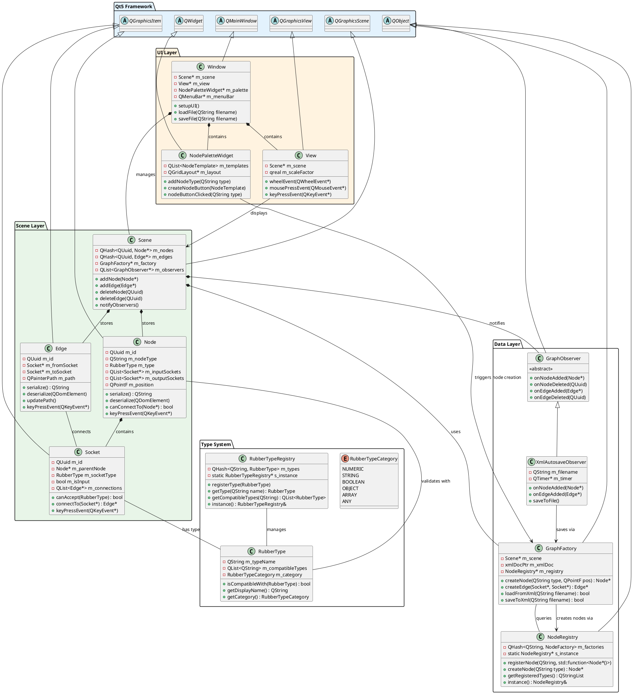

# NodeGraph UML Architecture

## Core Class Diagram



## Component Interaction Flow

### 1. Node Creation Flow
```
User clicks palette → NodePaletteWidget → GraphFactory → NodeRegistry → Node created → Scene adds → Observers notified → XML updated
```

### 2. Connection Creation Flow  
```
User drags socket → View captures → Scene validates → Socket checks RubberType → Edge created → Observers notified → XML updated
```

### 3. File Load Flow
```
User opens file → Window → GraphFactory → XML parsed → Nodes/Edges created → Scene populated → View refreshed
```

### 4. Type Checking Flow
```
Socket connection attempt → RubberType compatibility check → Connection allowed/denied → UI feedback
```

## Architecture Benefits

1. **Separation of Concerns**: UI, Scene, Data, and Types are cleanly separated
2. **Observer Pattern**: Automatic synchronization without tight coupling  
3. **Factory Pattern**: Extensible node creation system
4. **Registry Pattern**: Dynamic type system management
5. **Self-Serialization**: Each object manages its own persistence
6. **Type Safety**: Rubber types prevent invalid connections

---

*This UML represents the target architecture after JavaScript removal and rubber types integration.*